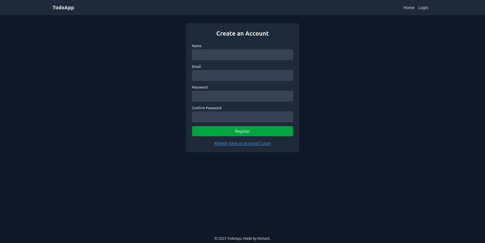
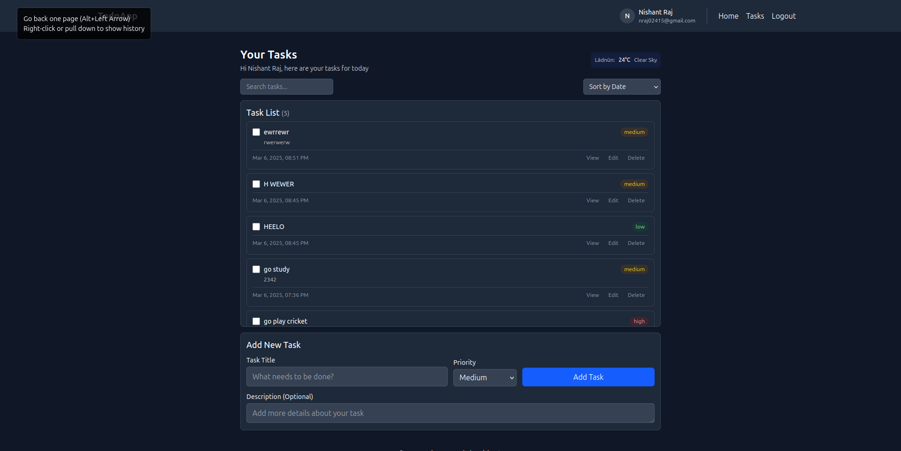
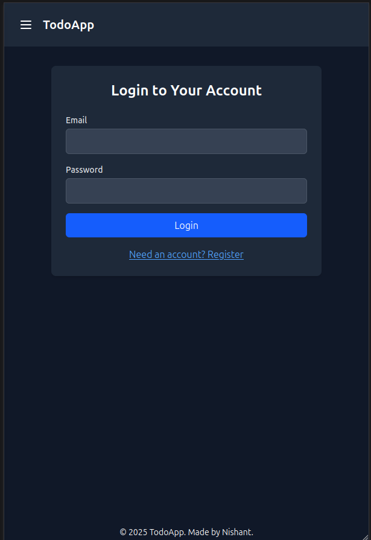
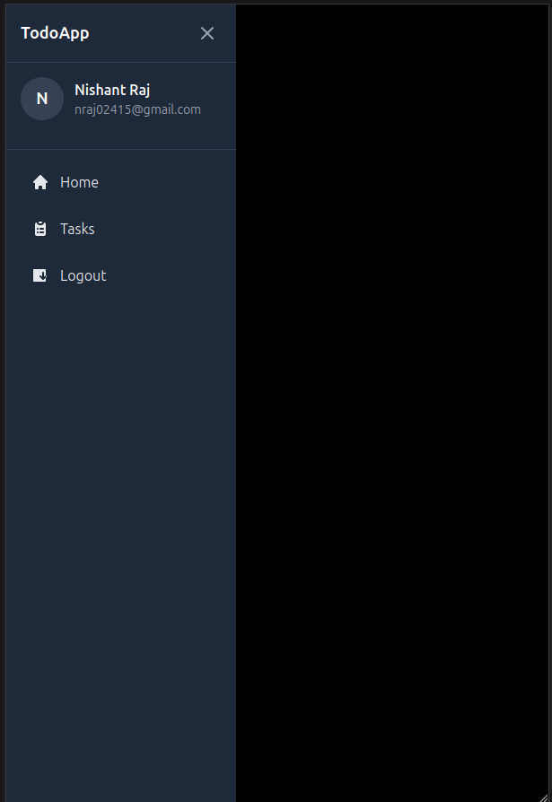
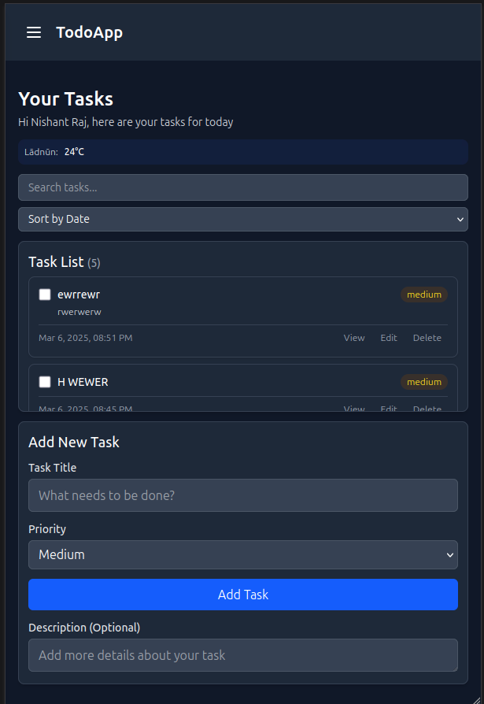
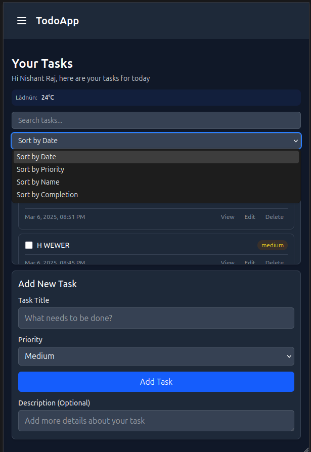

# Modern Todo Application

## 📸 Screenshots




### Mobile View






## 🚀 Features

- **Authentication System**

  - User registration and login
  - Persistent authentication using localStorage
  - Mock authentication system (easily replaceable with real backend)

- **Task Management**

  - Create, Read, Update, and Delete tasks
  - Task priorities (High, Medium, Low)
  - Task completion status
  - Task descriptions and creation timestamps
  - Sort tasks by date, priority, name, or completion status
  - Search functionality for tasks

- **Weather Integration**

  - Real-time weather display using OpenWeatherMap API
  - Location-based weather information

- **Theme System**

  - Persistent theme preference
  - System theme detection

- **Responsive Design**
  - Mobile-first approach
  - Responsive sidebar navigation
  - Adaptive layouts for all screen sizes

## 🛠️ Technical Stack

- **Frontend Framework**: React with Vite
- **State Management**: Redux Toolkit
- **Styling**: TailwindCSS
- **Routing**: React Router v7
- **UI Components**: Custom components with Headless UI
- **API Integration**: Axios
- **Storage**: LocalStorage for persistence

## 📦 Project Structure

```
todo-app/
├── src/
│   ├── api/           # API integration
│   ├── components/    # Reusable components
│   ├── hooks/         # Custom hooks
│   ├── pages/         # Page components
│   ├── redux/         # Redux store and slices
│   └── utils/         # Helper functions
```

## 🎯 Core Components

1. **Task Management**

   - TaskInput: Task creation form
   - TaskList: List of tasks
   - TaskItem: Individual task display and actions

2. **Authentication**

   - Login: User login form
   - Register: User registration form

3. **Layout**
   - Header: Navigation and theme toggle
   - Footer: Application footer

## 🔨 Implementation Details

### State Management

- Uses Redux Toolkit for centralized state management
- Separate slices for tasks, authentication, and theme
- Async operations handled with Redux Thunks

### Data Persistence

- Tasks stored in localStorage
- User authentication state persisted
- Theme preference saved locally

### Styling

- TailwindCSS for utility-first styling
- Dark mode support with class strategy
- Responsive design breakpoints

### Authentication Flow

- Mock authentication system
- JWT token simulation
- Protected routes implementation

## 🚦 Getting Started

1. Clone the repository

```bash
git clone <repository-url>
```

2. Install dependencies

```bash
cd Todo_app_assignment
npm install
```

3. Set up environment variables

```bash
touch .env
VITE_OPEN_WEATHER_API="your-api-key" #paste this as it is and replace your-api-key with your OpenWeatherMap API key

# Edit .env with your OpenWeatherMap API key
```

4. Start the development server

```bash
npm run dev
```

## 🤝 Contributing

Feel free to open issues and pull requests!

## 📄 License

MIT License - feel free to use this project for learning or personal use.
